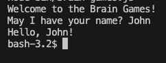
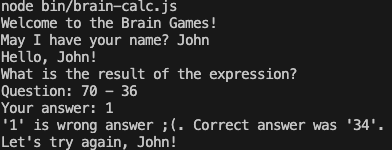
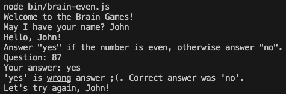
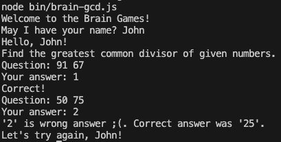
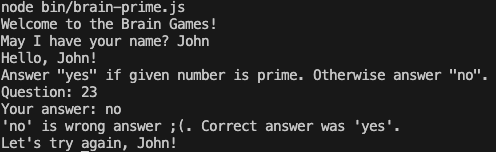
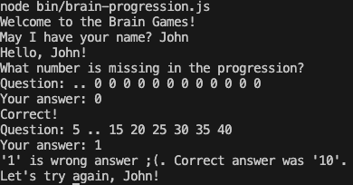

### Hexlet tests and linter status:

# Для установки Вам нужно выполнить следующие команды:
    git clone https://github.com/grittyzavr/frontend-project-44
    cd frontend-project-44
    make install

# brain-games

# brain-calc

# brain-even

# brain-gcd

# brain-prime

# brain-progression

